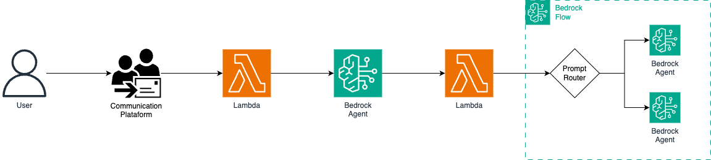

# AWS Bedrock Multi-Agent Orchestration Framework

[](https://www.serverless.com/)
[](https://www.python.org/downloads/release/python-3120/)
[](https://aws.amazon.com/bedrock/)

A simplified framework for building and deploying sophisticated multi-agent AI systems using AWS Bedrock. This project enables seamless orchestration between specialized AI agents through AWS Bedrock Flow, maintaining conversation context and delivering coherent user experiences.

## 🌟 Features

- **Specialized Agent Network**: Deploy multiple domain-specific agents (HR, general knowledge, etc.)
- **Intelligent Orchestration**: Route user queries to appropriate agents via Bedrock Flow
- **Session Management**: Maintain conversation history and context across agent interactions
- **Serverless Architecture**: Fully serverless implementation using AWS Lambda and Bedrock services
- **Infrastructure as Code**: Complete CloudFormation templates via Serverless Framework
- **Production Ready**: Includes logging, error handling, and monitoring capabilities

## 🏗️ Architecture



The system consists of:

- **Specialized Bedrock Agents**: Domain-specific agents with tailored knowledge and capabilities
  - General Agent: Handles broad knowledge queries
  - HR/Consulting Agent: Specializes in human resources topics with dedicated knowledge base
  - Orchestration Agent: Coordinates between agents via Bedrock Flow
- **AWS Bedrock Flow**: Manages the conversation flow and agent interactions
- **Lambda Functions**: Process requests and handle agent communication
- **API Gateway**: Provides REST endpoints for client applications

## 🚀 Quick Start

### Prerequisites

- [AWS CLI](https://aws.amazon.com/cli/) configured with appropriate permissions
- [Node.js](https://nodejs.org/) (v14 or later)
- [Serverless Framework](https://www.serverless.com/) installed globally
- [Python 3.12](https://www.python.org/downloads/release/python-3120/)
- AWS Account with Bedrock access

### Installation

1. **Clone the repository**

```bash
git clone https://github.com/yourusername/multi-agent-orchestration.git
cd multi-agent-orchestration
```

2. **Install dependencies**

```bash
npm install
python -m venv venv
source venv/bin/activate  # On Windows: venv\Scripts\activate
pip install -r requirements.txt
```

3. **Configure your environment**

Create a `params.dev.json` file in the project root:

```json
{
  "API_NAME": "your-project-name"
}
```

4. **Create your Bedrock Flow**

- Create a Bedrock Flow in the AWS Console
- Update the `YOUR_FLOW_ID` and `YOUR_FLOW_ALIAS_ID` placeholders in `serverless.yml` with your Flow IDs

5. **Deploy the application**

```bash
serverless deploy --stage dev --param-file params.dev.json
```

## 🔧 Configuration

### Agents Configuration

The project includes three types of agents:

1. **General Agent**: Handles broad knowledge queries

   - Configuration: `infrastructure/ai/general_agent.yml`

2. **Consulting/HR Agent**: Specializes in human resources topics

   - Configuration: `infrastructure/ai/hr_agent.yml`
   - Includes knowledge base integration

3. **Orchestration Agent**: Coordinates between agents
   - Configuration: `infrastructure/ai/orchestration_agent.yml`
   - Includes action group for invoking Bedrock Flow

### Bedrock Flow Setup

1. Create a new Flow in AWS Bedrock Console
2. Configure the Flow to connect your specialized agents
3. Create a Flow alias
4. Update the Flow IDs in `serverless.yml`:

```yaml
environment:
  FLOW_ID: your-flow-id
  FLOW_ALIAS_ID: your-flow-alias-id
```

#### Example of Bedrock Flow Step:

1. Configure your Prompt Management, based on:

- LLM: amazon.nova-micro-v1:0
- Temperature: 0
- Top P: 0.9
- Maximum output tokens: 50
- Prompt:

```md
<task> Categorize the user's message into one of two categories based on the **overall intention**. </task> <instructions> 1. Carefully read the user's message: <input>{{input}}</input> 2. Analyze the main intention expressed in the message. 3. Classification criteria: - <category>HR</category>: Messages related to human resources, such as: _ Salary _ Benefits \_ Company <category>GENERAL</category>: Messages related to general topics for internet search, which do not fit into the previous categories. 4. Respond with exactly one of the following formats: - If related to human resources: HR - If related to general topics: GENERAL </instructions> <constraints> - Provide **only** the categorized response in the specified format - Do not include explanations, comments, or additional text - Base the classification on the **main intention** of the message in {{input}} - If the message is ambiguous, classify based on the most prominent theme - For messages classified as GENERAL, the system should ask how it can help or request more details about what the user wants to discuss </constraints>
```

2. Configure your Bedrock Flow, based on:

```json
{
  "connections": [
    {
      "configuration": {
        "data": {
          "sourceOutput": "document",
          "targetInput": "input"
        }
      },
      "name": "FlowInputNodeFlowInputNode0Toprompt_routerPromptsNode0",
      "source": "FlowInputNode",
      "target": "prompt_router",
      "type": "Data"
    },
    {
      "configuration": {
        "data": {
          "sourceOutput": "modelCompletion",
          "targetInput": "conditionInput"
        }
      },
      "name": "prompt_routerPromptsNode0Tocategory_validateConditionNode0",
      "source": "prompt_router",
      "target": "category_validate",
      "type": "Data"
    },
    {
      "configuration": {
        "conditional": {
          "condition": "general_router"
        }
      },
      "name": "category_validateConditionNodeHandle0Togeneral_agentgeneral_agentHeaderHandle",
      "source": "category_validate",
      "target": "general_agent",
      "type": "Conditional"
    },
    {
      "configuration": {
        "data": {
          "sourceOutput": "document",
          "targetInput": "agentInputText"
        }
      },
      "name": "FlowInputNodeFlowInputNode0Togeneral_agentAgentsNode0",
      "source": "FlowInputNode",
      "target": "general_agent",
      "type": "Data"
    },
    {
      "configuration": {
        "conditional": {
          "condition": "hr_router"
        }
      },
      "name": "category_validateConditionNodeHandle1Tohr_agenthr_agentHeaderHandle",
      "source": "category_validate",
      "target": "hr_agent",
      "type": "Conditional"
    },
    {
      "configuration": {
        "data": {
          "sourceOutput": "document",
          "targetInput": "agentInputText"
        }
      },
      "name": "FlowInputNodeFlowInputNode0Tohr_agentAgentsNode0",
      "source": "FlowInputNode",
      "target": "hr_agent",
      "type": "Data"
    },
    {
      "configuration": {
        "data": {
          "sourceOutput": "agentResponse",
          "targetInput": "document"
        }
      },
      "name": "general_agentAgentsNode0Togeneral_agent_outputFlowOutputNode0",
      "source": "general_agent",
      "target": "general_agent_output",
      "type": "Data"
    },
    {
      "configuration": {
        "data": {
          "sourceOutput": "agentResponse",
          "targetInput": "document"
        }
      },
      "name": "hr_agentAgentsNode0Tohr_agent_outputFlowOutputNode0",
      "source": "hr_agent",
      "target": "hr_agent_output",
      "type": "Data"
    }
  ],
  "nodes": [
    {
      "configuration": {
        "input": {}
      },
      "name": "FlowInputNode",
      "outputs": [
        {
          "name": "document",
          "type": "String"
        }
      ],
      "type": "Input"
    },
    {
      "configuration": {
        "prompt": {
          "sourceConfiguration": {
            "resource": {
              "promptArn": "arn:aws:bedrock:YOUR_REGION_NAME:YOUR_ACCOUNT_ID:prompt/YOUR_PROMPT_ID:3"
            }
          }
        }
      },
      "inputs": [
        {
          "expression": "$.data",
          "name": "input",
          "type": "String"
        }
      ],
      "name": "prompt_router",
      "outputs": [
        {
          "name": "modelCompletion",
          "type": "String"
        }
      ],
      "type": "Prompt"
    },
    {
      "configuration": {
        "output": {}
      },
      "inputs": [
        {
          "expression": "$.data",
          "name": "document",
          "type": "String"
        }
      ],
      "name": "general_agent_output",
      "type": "Output"
    },
    {
      "configuration": {
        "condition": {
          "conditions": [
            {
              "expression": "conditionInput==\"GENERAL\"",
              "name": "general_router"
            },
            {
              "expression": "conditionInput==\"HR\"",
              "name": "hr_router"
            },
            {
              "name": "default"
            }
          ]
        }
      },
      "inputs": [
        {
          "expression": "$.data",
          "name": "conditionInput",
          "type": "String"
        }
      ],
      "name": "category_validate",
      "type": "Condition"
    },
    {
      "configuration": {
        "agent": {
          "agentAliasArn": "arn:aws:bedrock:YOUR_REGION_NAME:YOUR_ACCOUNT_ID:agent-alias/YOUR_AGENT_ID/YOUR_AGENT_ALIAS_ID"
        }
      },
      "inputs": [
        {
          "expression": "$.data",
          "name": "agentInputText",
          "type": "String"
        }
      ],
      "name": "general_agent",
      "outputs": [
        {
          "name": "agentResponse",
          "type": "String"
        }
      ],
      "type": "Agent"
    },
    {
      "configuration": {
        "agent": {
          "agentAliasArn": "arn:aws:bedrock:YOUR_REGION_NAME:YOUR_ACCOUNT_ID:agent-alias/YOUR_AGENT_ID/YOUR_AGENT_ALIAS_ID"
        }
      },
      "inputs": [
        {
          "expression": "$.data",
          "name": "agentInputText",
          "type": "String"
        }
      ],
      "name": "hr_agent",
      "outputs": [
        {
          "name": "agentResponse",
          "type": "String"
        }
      ],
      "type": "Agent"
    },
    {
      "configuration": {
        "output": {}
      },
      "inputs": [
        {
          "expression": "$.data",
          "name": "document",
          "type": "String"
        }
      ],
      "name": "hr_agent_output",
      "type": "Output"
    }
  ]
}
```

## 📊 Usage

### API Endpoints

The deployment creates a Lambda function URL that serves as the entry point for your application:

```
POST /assistant_response
```

**Request Body:**

```json
{
  "session_id": "unique-session-identifier",
  "prompt": "Your question or request here"
}
```

**Response:**

```json
{
  "response": "Agent's response to the query"
}
```

### Agent Invocation Flow

1. User sends a query to the API endpoint
2. The orchestration agent analyzes the query
3. The orchestration agent invokes Bedrock Flow
4. Bedrock Flow routes the query to the appropriate specialized agent
5. The specialized agent processes the query and returns a response
6. The response is returned to the user with maintained conversation context

## 🧩 Extending the Framework

### Adding a New Specialized Agent

1. Create a new agent configuration file in `infrastructure/ai/`
2. Define the agent's IAM role, agent configuration, and alias
3. Add the new agent to `serverless.yml` resources section
4. Update your Bedrock Flow to include the new agent

### Customizing Agent Behavior

Modify the agent instructions in the respective YAML files:

```yaml
Instruction: |
  <instruction>
  You are virtual AI assistant and your task is to analyze the provided context and generate a relevant response based on it.
  </instruction>

  <context>
  Role: [Define your agent's specialized role here]
  </context>

  <constraints>
  [Define constraints for your agent]
  </constraints>

  <output_format>
  Response: [Insert your response here]
  </output_format>
```

## 📝 Logging and Monitoring

The project uses AWS Lambda Powertools for Python to provide structured logging and tracing:

- **Logging**: Comprehensive logs for all Lambda functions
- **Tracing**: X-Ray integration for request tracing
- **Error Handling**: Standardized error responses

## 🔒 Security

- IAM roles with least privilege principle
- Session management for secure user interactions
- AWS Bedrock security best practices

## 🤝 Contributing

Contributions are welcome! Please feel free to submit a Pull Request.

1. Fork the repository
2. Create your feature branch (`git checkout -b feature/amazing-feature`)
3. Commit your changes (`git commit -m 'Add some amazing feature'`)
4. Push to the branch (`git push origin feature/amazing-feature`)
5. Open a Pull Request

## 📚 Resources

- [AWS Bedrock Documentation](https://docs.aws.amazon.com/bedrock/)
- [Serverless Framework Documentation](https://www.serverless.com/framework/docs/)
- [AWS Lambda Powertools for Python](https://awslabs.github.io/aws-lambda-powertools-python/)

---

Built with ❤️ by Gustavo Mainchein
